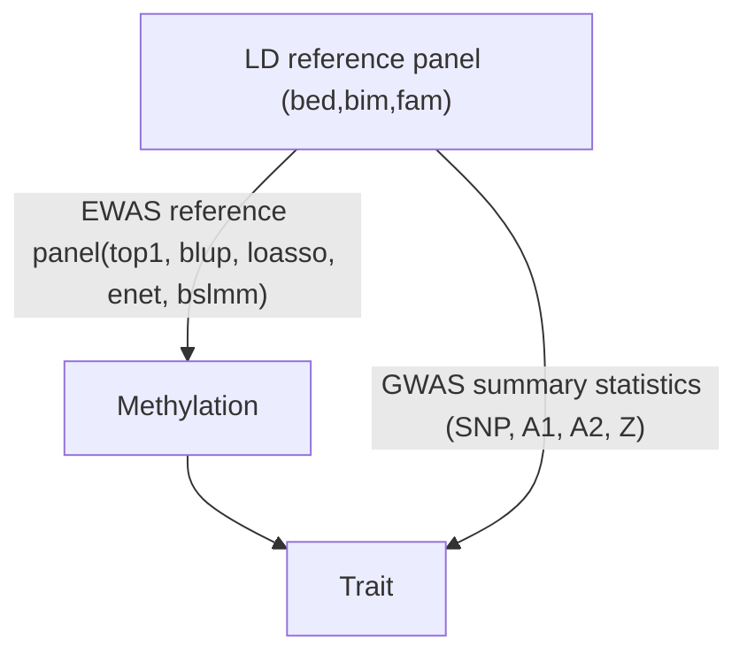
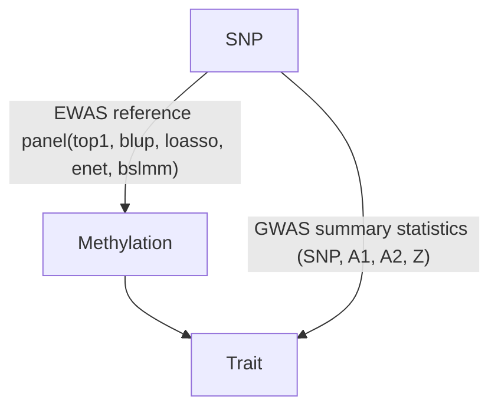

# EWAS-fusion

**Epigenomewide association study (EWAS) and Functional Summary-based Imputation (FUSION) association analyses**

## INTRODUCTION

Transcriptomewide association statistic $z_{TWAS}$ was originally proposed
for gene expression data. For a given Trait of interest **T** for which
GWAS summary statistics $z_T$ is available, the corresponding
Wald statistic for TWAS is defined such that
$$
z_{TWAS} = \frac{w^T_{ge}z_T}{\sqrt{w^T_{ge}Vw_{ge}}}
$$

where $w_{ge}$ is a weight associated with gene expression and
**V** covariance matrix for $z_T$, respectively.

By analogy, an epigenomewide association statistic $z_{EWAS}$ is defined through
methylation data so that
$$
z_{EWAS} = \frac{w^T_{me}z_T}{\sqrt{w^T_{me}Vw_{me}}}
$$

where $w_{me}$ is the weight associated with methylation. Both
approaches allow for imputation using GWAS summary statistics. The
derivation of these weights and imputation were done using methods as
described in Gusev et al. (2016) called TWAS as well as in Mancuso et
al. (2016) called Functional Summary-based Imputation (FUSION). The TWAS
statistics from both approaches agreed very well.




A total of 442,920 CpG sites based on Illumina humanmethylation450 chips
on 1,.146 individuals in EPIC-Norfolk study were available. Among these,
1,117 individuals also had genotype data from Affymetrix BioBank Axiom
chips. HapMap2 SNPs from genetic data of these individuals were
extracted via PLINK2 according to cis-positions of each probe and
subsequently used to build weight analogous to gene expression data as
implemented in computer software TWAS. We filtered probes according to
their heritabilities estimated from software GCTA at significant level
of 0.01. We then performed EWAS for given GWAS summary statistics. The
weight generation and methylation imputation was implemented in software
called TWAS-pipeline, which allows for whole epigenome computation.
After filtering, 78,133 probes reached significant level 0.01.

The FUSION framework has several advantages: First, it integrates
heritability estimation and covariate adjustment for whole-chromosomes
with additional models such as LASSO, elastic net, BLUP. Second, it
offers cross-validation, joint/conditional analyses with the output also
informing top hit SNPs and inferred methylation quantitative trait locus
(meQTL). Besides, the new software uses modified GCTA software
(gcta\_nr\_robust) leading to higher yield of probes with heritabilities
reaching statistical significance, GEMMA giving BSLMM estimates and
ability to align strands with reference panels. As both the increased
number of models and cross-validation led to excessive computing time,
we dropped BSLMM models and conducted five cross-validations. As a
result our reference panel for EWAS imputation contains 77,372 probes
reaching the heritability p value threshold of 0.01. The association as
well as joint/conditional analysis using our weights and LD panel is
implemented in software called EWAS-fusion. Like the original TWAS, our
implementation will enable a range of GWAS summary statistics to be used
coupled with downstream analysis.

EWAS-fusion is reminiscent of Mendelian Randomisation as shown below,




## INSTALLATION

* To begin, the software [FUSION](http://gusevlab.org/projects/fusion/) including dependencies such as `plink2R` and `reshape` is required. The latest version also 
requires [jlimR](https://github.com/cotsapaslab/jlim). Other facilities to be required are Sun grid engine (sge) or GNU parallel for Linux clusters.

* Install the repository on your system, you will need weights based on epigenetic data or to generate them as described in **Weight generation** below.

FILE | Description
-----|---------------------------
EWAS-weights/ | directory for EWAS weights
glist-hg19 | Probe list
LDREF/ | Reference for LD
EWAS-weights.pos | Definition of regions
EWAS-weights.profile* | Probe profiles

`*` It contains information about the probes but not directly involved in the association analysis. Earlier version of EWAS-fusion used EWAS/, RDat.pos, and
RDat.profile.

## USAGE

The syntax is as follows,
```
ewas-fusion.sh input-file
```
These will send jobs to the Linux clusters. The sge error and output, if any, should be called EWAS.e and EWAS.o in your HOME directory.

## Input

The input file contains GWAS summary statistics similar to [.sumstats](https://github.com/bulik/ldsc/wiki/Summary-Statistics-File-Format) as in [LDSC](https://github.com/bulik/ldsc) with the following columns.

   Column | Name | Description
   -------|------|------------  
   1 | SNP | RS id of SNPs
   2 | A1 | Effect allele (first allele)
   3 | A2 | Other allele (second allele)
   4 | Z | Z-scores, taking sign with repect to A1

## Output

The results will be in input-file.tmp/ directory.

## Annotation

This is furnished with contribution from Dr Alexia Cardona, alexia.cardona@mrc-epid.cam.ac.uk, as follows,
```
Rscript ewas-annotate.R input-file.tmp
```
It is assumed that `HumanMethylation450_15017482_v1-2.csv` is available from the directory containing `ewas-annotate.R`but this can be at different location
```
Rscript ewas-annotate.R input-file.tmp manifest_location=/at/different/location
```
Q-Q and Manhattan plots using R/gap can be obtained from
```
Rscript ewas-plot.R input-file.tmp
```

## Example

The script [test.sh](test.sh) uses data reported in Wood, et al. (2015). It downloads and generates an input file called `height` to `ewas-fusion.sh`. 
```
ewas-fusion.sh height
```
The results will be in `height.tmp/` once it is done.

The annotation is done with
```
Rscript ewas-annotate.R height.tmp
```
The Q-Q and Manhattan plots are generated with
```
Rscript ewas-plot.R height.tmp
```

## Weight generation

This is a revised and much simplified implementation of codes available from TWAS-pipeline. Under our sge it is furnished with
```
qsub get_weight.qsub
```
or
```
qsub get_weight.qsub 22
```
for chromosome 22.

Inputs to these are summarised as follows, 

File | Description
-----|--------------------------------------------------------------
FUSION.pheno | PLINK phenotype file containing data for all probes
FUSION.covar | PLINK covariate file containing covariates such as PCs
CpG.txt | CpG ID, chromosome and position

In addition, PLINK binary pedigree file for each CpG also requires to be prepared, as in [files](files). Although it was not done,
it is possible to use code as in [1KG.sh](files/1KG.sh) to get around gerneration of these individual files by using a combined one.
Note the setup takes advantage of the compact storage of non-genetic data.

The results will be available from the EWAS-fusion directory to be profiled and used for association analysis above. As the number of files is fairly large,
[cp_weight.qsub](files/cp_weight.qsub) is written to put weights from their temporary directories in place while [ewas-profile.sh](files/ewas-profile.sh)
profiles these weights as well as prepares for LDREF. For [the version with FUSION](https://data.broadinstitute.org/alkesgroup/FUSION/LDREF.tar.bz2), it can be done as follows,
```bash
wget -qO- https://data.broadinstitute.org/alkesgroup/FUSION/LDREF.tar.bz2 | tar xfj - --strip-components=1
seq 22|awk -vp=1000G.EUR. '{print p $1}' > merge-list
plink-1.9 --merge-list merge-list --make-bed --out FUSION
rm 1000G.EUR.* merge-list
sort -k2,2 FUSION.bim > EUR.bim
```
To mirror FUSION, which uses [glist-hg19](https://www.cog-genomics.org/static/bin/plink/glist-hg19), an equivalent for EWAS needs to be built.

## ACKNOWLEDGEMENTS

We wish to thank colleagues and collaborators for their invaluable contributions to make this work possible.

## REFERENCES

Freund MK, et al. (2018). Phenotype-specific enrichment of Mendelian disorder genes near GWAS regions across 62 complex traits. *American Journal of Human Genetics* 103:535-552, https://www.cell.com/ajhg/fulltext/S0002-9297(18)30285-4

Gusev A, et al. (2016). Integrative approaches for large-scale transcriptome-wide association studies. *Nature Genetics* 48:245-252

Mancuso N, et al. (2017). Integrating gene expression with summary association statistics to identify susceptibility genes for 30 complex traits. *American Journal of Human Genetics* 100:473-487, http://www.cell.com/ajhg/fulltext/S0002-9297(17)30032-0.

Raj T, et al. (2018). Integrative transcriptome analyses of the aging brain implicate altered splicing in Alzheimer’s disease susceptibility. *Nature Genetics*, https://www.nature.com/articles/s41588-018-0238-1

Turner SD (2014). qqman: an R package for visualizing GWAS results using Q-Q and manhattan plots. *biorXiv* DOI: 10.1101/005165

Wood AR, et al. (2014). Defining the role of common variation in the genomic and biological architecture of adult human height (2014). *Nature Genetics* 46:1173-1186.

Zhao JH (2007). gap: Genetic Analysis Package. *Journal of Statistical Software* 23(8):1-18, http://www.jstatsoft.org/v23/i08 ([version at CRAN](https://CRAN.R-project.org/package=gap)).

## APPENDIX

Additional information for Illumina infinium humanmethylation450 beadchip as in [Illumina website](https://support.illumina.com/array/array_kits/infinium_humanmethylation450_beadchip_kit/downloads.html)

**Column Name**|**Description**
---------------|------------------------------------------------------------------------
Index|Probe Index
TargetID|Identifies the probe name. Also used as a key column for data import.
ProbeID_A|Illumina identifier for probe sequence A
ProbeID_B|Illumina identifier for probe sequence B
IlmnID|Unique CpG locus identifier from the Illumina CG database
Name|Unique CpG locus identifier from the Illumina CG database
AddressA_ID|Address of probe A
AlleleA_ProbeSeq|Sequence for probe A
AddressB_ID|Address of probe  B
AlleleB_ProbeSeq|Sequence for probe B
Infinium_Design_Type|Defines Assay type - Infinium I or Infinium II
Next_Base|Base added at SBE step - Infinium I assays only
Color_Channel|Color of the incorporated baseá (Red or Green) - Infinium I assays only
Forward_Sequence|Sequence (in 5'-3' orientation) flanking query site
Genome_Build|Genome build on which forward sequence is based
CHR|Chromosome - genome build 37
MAPINFO|Coordinates - genome build 37
SourceSeq|Unconverted design sequence
Chromosome_36|Chromosome - genome build 36
Coordinate_36|Coordinates - genome build 36
Strand|Design strand
Probe_SNPs|Assays with SNPs present within probe >10bp from query site
Probe_SNPs_10|Assays with SNPs present within probe ?10bp from query site (HM27 carryover or recently discovered)
Random_Loci|Loci which were chosen randomly in the design proccess
Methyl27_Loci|Present or absent on HumanMethylation27 array
UCSC_RefGene_Name|Gene name (UCSC)
UCSC_RefGene_Accession|Accession number (UCSC)
UCSC_RefGene_Group|Gene region feature category (UCSC)
UCSC_CpG_Islands_Name|CpG island name (UCSC)
Relation_to_UCSC_CpG_Island|Relationship to Canonical CpG Island: Shores - 0-2 kb from CpG island; Shelves - 2-4 kb from CpG island.
Phantom|FANTOM-derived promoter
DMR|Differentially methylated region (experimentally determined)
Enhancer|Enhancer element (informatically-determined)
HMM_Island|Hidden Markov Model Island
Regulatory_Feature_Name|Regulatory feature (informatically determined)
Regulatory_Feature_Group|Regulatory feature category
DHS|DNAse hypersensitive site (experimentally determined)

## Bioconductor packages

These are **IlluminaHumanMethylation450kanno.ilmn12.hg19** and **IlluminaHumanMethylation450kmanifest** as shown in **minfiDataEPIC**.

```r
library(IlluminaHumanMethylation450kanno.ilmn12.hg19)
data(IlluminaHumanMethylation450kanno.ilmn12.hg19)
data(Locations)
data(Other)
data(Manifest)
data(SNPs.Illumina)
data(Islands.UCSC)
```
and for instance we have
```
> data(IlluminaHumanMethylation450kanno.ilmn12.hg19)
> IlluminaHumanMethylation450kanno.ilmn12.hg19
IlluminaMethylationAnnotation object
Annotation
  array: IlluminaHumanMethylation450k
  annotation: ilmn12
  genomeBuild: hg19
Available annotation
  Islands.UCSC
  Locations
  Manifest
  Other
  SNPs.132CommonSingle
  SNPs.135CommonSingle
  SNPs.137CommonSingle
  SNPs.138CommonSingle
  SNPs.141CommonSingle
  SNPs.142CommonSingle
  SNPs.144CommonSingle
  SNPs.146CommonSingle
  SNPs.147CommonSingle
  SNPs.Illumina
Defaults
  Locations
  Manifest
  SNPs.137CommonSingle
  Islands.UCSC
  Other
```
